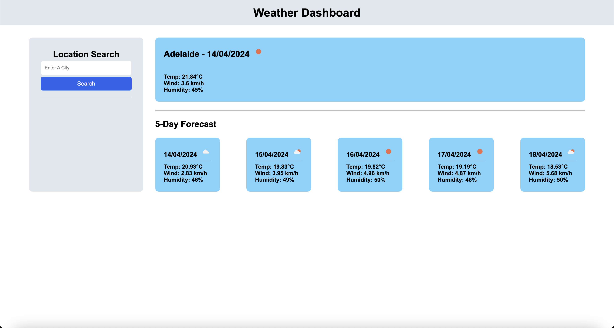
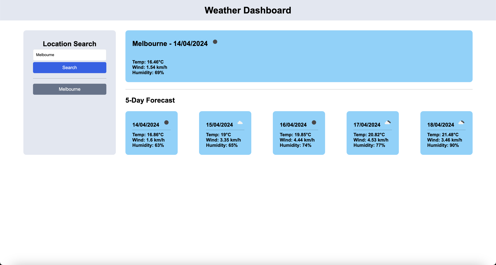
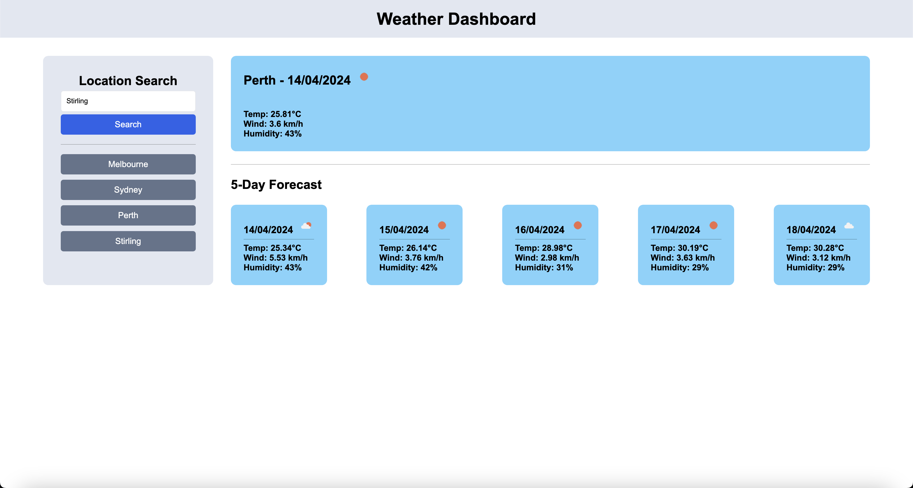

# Weather Dashboard

## Description

Check your local weather forecast with this weather dashboard, powered by the Open Weather Map API.

## Table of Contents

- [Description](#description)
- [Installation](#installation)
- [Usage](#usage)
- [Contribution](#contribution)
- [Tests](#tests)
- [License](#license)
- [Questions](#questions)

## Installation Instructions

There are no installation instructions for this project.

## Usage

To view this weather dashboard, please visit the GitHub pages [link](https://mattkellyirl.github.io/weather-dashboard/).

By default, the application will load the latest weather forecast for Adelaide, South Australia. To view weather forecasts for other locations (eg. Sydney, Melbourne, Perth etc), search for a country, state or suburb name in the search form.

</img>

Your recent searches will be saved in the location search container. If you would like to re-visit that location, click on the location and the application will reload the relevant weather forecast.

</img>

</img>

## Contribution Guidelines

This project was developed by Matt Kelly.

## Tests

There are no tests associated with this project.

## License

This project is not licensed. For more information regarding licences, please visit this link: https://opensource.org/license/

## Questions

Please feel free to contact me via my GitHub or email below for any questions associated with this application:  
GitHub: [mattkellyirl](https://github.com/mattkellyirl)  
Email: mattkellyvisual@gmail.com
